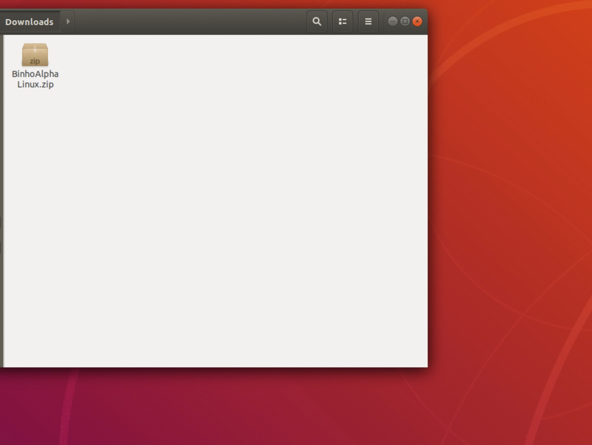

# QuickStart with GUI

### Step \#1: Download and Install the Binho Mission Control Software

Our cross-platform software, called Mission Control, is available for Windows, Mac, and Linux and provides an easy-to-use GUI interface for your _Binho Nova_. Download the appropriate release for your operating system here:



Once the download completes, unzip the directory. The Windows 32bit and Windows 64bit releases are distributed with .exe installers, whereas Mac and Linux distributions can simply be unzipped and run.


The Windows Defender SmartScreen prompt is displayed when running the installer. Click "_More Info_" and then the "_Run Anyway_" button to continue. Our software releases are no codesigned, however we're still building our reputation within Microsoft SmartScreen so that eventually this warning will go away.


Here's what the process looks like on Mac:

If this is the first time that you're connecting to a virtual COM port on your Mac, you will need ensure your user account has the correct permissions. Please see the following support page if this is your first time:



Here's what the process looks like on Ubuntu:

Note that there are some nuances with permissions when running on Linux systems. Please see the follow support page for more details on setting the required permissions:



### Step \#2: Launch the Mission Control Software & Connect to the Device

Now it's time to launch the software. If you haven't done so already, connect the _Binho Nova_ to you computer using the provided USB Cable. Once you've launched the application, the available devices will be displayed in a drop-down box at the top. Simply click the "Connect" button to connect to the selected host adapter. If no devices are shown in the list, go ahead and click the "Refresh" button to check again, perhaps it was still enumerating after plug-in when the software initially checked for devices.

### Step \#3: Set the Operation Mode

The device mode of operation is displayed in the bottom left corner of the main application window. The default mode of operation is IO, where all 5 pins can be used for any function from the IO tab of the software. Activating SPI or I2C modes of operation will assign the pins associated with those protocols to their protocol-specific function, and the remaining unused IO pins will still be available for use from the IO tab. Setting SPI or I2C mode of operation is done on the respective protocol tab as shown below.

### Step \#4: Interact

At this point, you're all set to start interacting with your device. For final step, please take a look at the pages below depending on which mode of operation is most interesting / applicable to your needs:










We're working on adding GUI support for 1-Wire and SWI protocols, as well as implementing advanced features to aid in automated testing -- all this and more coming soon!


