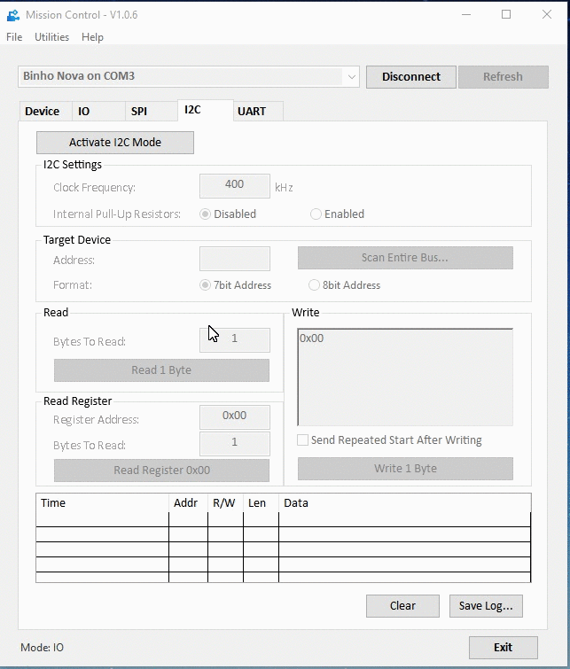
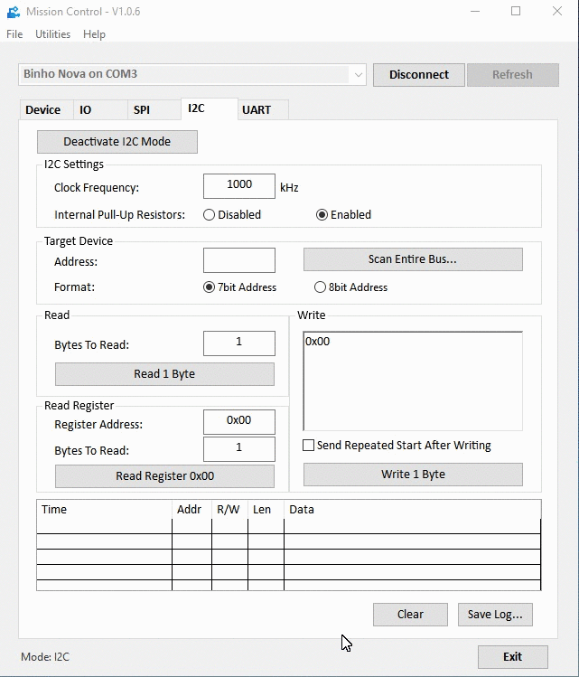
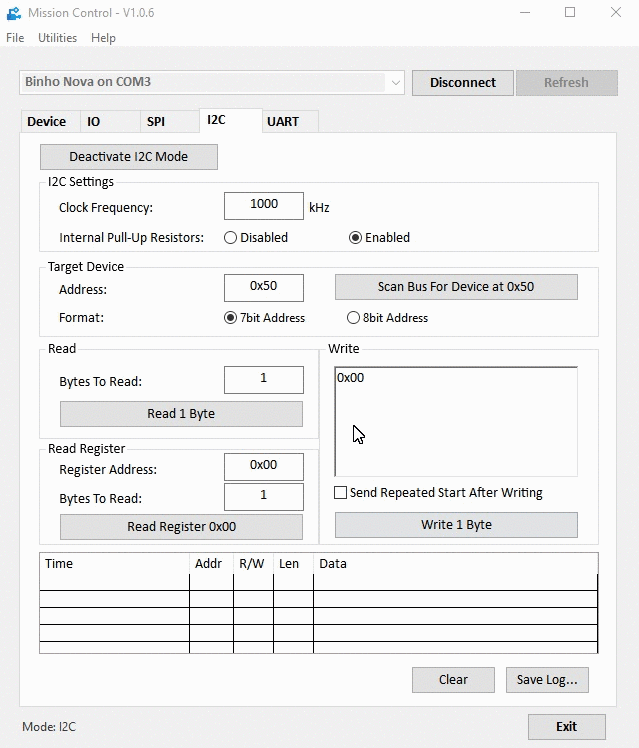
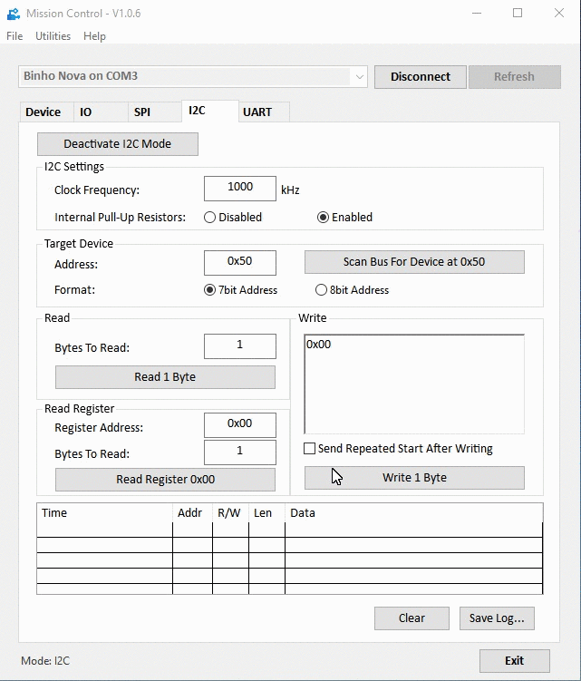
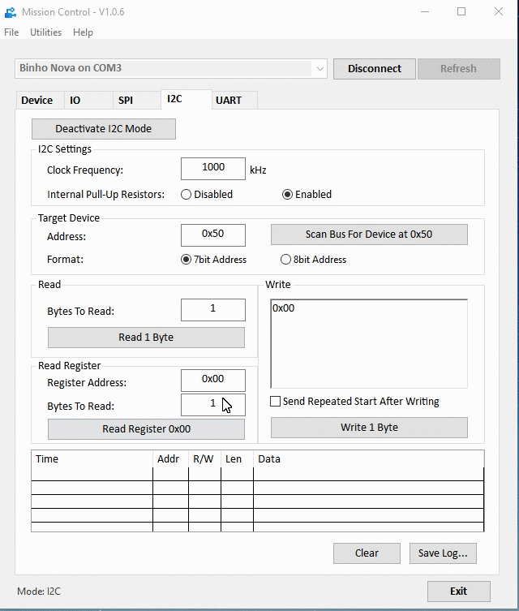
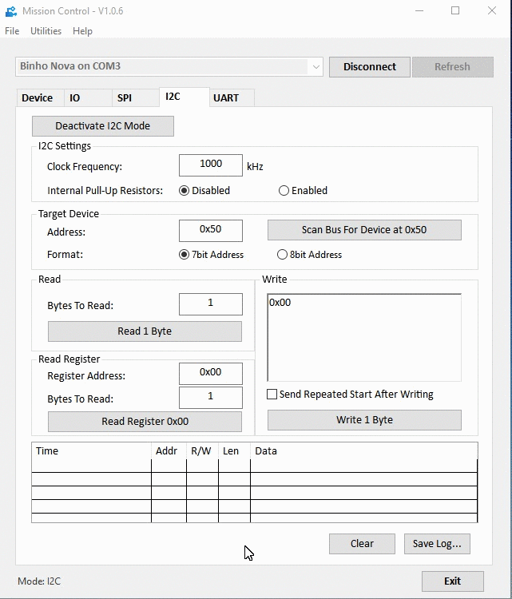

# I2C in Mission Control

The diagram below shows the pin assignments \(in purple\) for the SCL and SDA pins on the _Binho Nova Multi-Protocol USB Host Adapter_ when it is in I2C mode.

### Configuring the I2C Bus Settings

Once the I2C mode of operation has been activated by clicking the "Activate I2C Mode" button on the I2C tab, the I2C settings will be unlocked and ready for configuration.

The _Binho Nova_ supports I2C bus clock frequencies from 100kHz up to 3.4MHz, which covers all common operating modes \(standard, full, fast, and high speed modes\). Clock stretching and repeated starts are also supported. There are internal pull-up resistors which can be engaged or disabled as necessary.

### Scanning for Devices

If you already know the address of your target I2C slave device, you can type it directly into the Address textbox \(in either decimal or hex, preceded by "0x"\). However, Binho makes it easy to discover devices on the I2C bus -- simply leave the "Address" textbox empty and click the "Scan Entire Bus..." button and the host adapter will check for devices on the bus. Any devices that are found will then be displayed in a listbox. Simply select the address of the device that you'd like to interact with from the list.

The remainder of the commands in this guide require that the "Target Address" has already been set, either by scanning the bus or via directly typing the slave address.


It's now possible to use both 7bit or 8bit formatted I2C addresses by selecting the preferred address formatting in the Target Device section.


### Reading Data

Reading data from the slave device is as simple as providing the number of bytes to read \(in either decimal or hex, preceded by "0x"\) and clicking the "Read \[n\] Byte\(s\)" button.

Note that the results of this action are displayed in the transaction list at the bottom of the window.

### Writing Data

Writing data to the slave device can be done by entering the data into the "Write" textbox and clicking the "Write \[n\] Byte\(s\)" button. An option checkbox can be selected to immediately send a repeated start bit after writing the data. Data can be typed in binary, decimal, or hex formats. In the case of binary, the 8bit value should be preceded by a prefix of "0b", likewise a hex value should be preceded by "0x". Numbers without a prefix will be evaluated as a decimal number.

For clarity, here is an example of a valid data transfer displayed in each of the three supported bases:

Decimal: `222 173 190 239`

Binary: `0b11011110 0b10101101 0b10111110 0b11101111`

Hex: `0xDE 0xAD 0xBE 0xEF`

Note that the results of this action are displayed in the transaction list at the bottom of the window.

### Read Register

While not an official part of the I2C specification, a very common implementation across various I2C devices makes it convenient to have a Read Register function. Read Register is effectively a 1-byte Write command which contains the desired register address, followed immediately by a read command.

The Read Register command supports both 8bit and 16bit register addresses. When targeting a 16bit register on a slave device, simply use the hex address padded with leading zeros as necessary.

For example, to address register `32` on a device which is expecting a 16-bit address, enter `0x0020` in the Register Address textbox.

Note that the results of this action are displayed in the transaction list at the bottom of the window.

