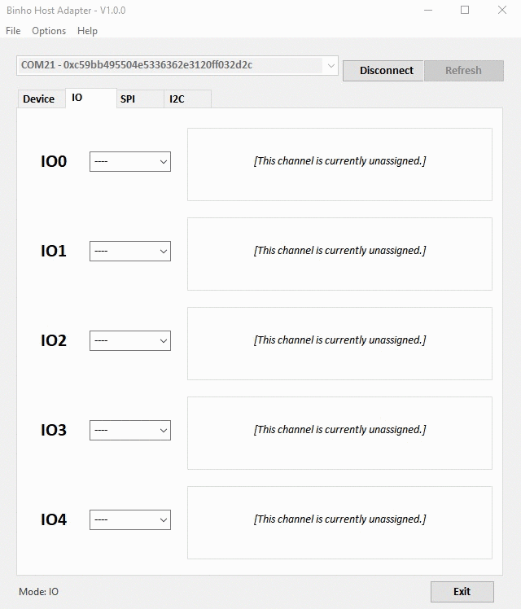
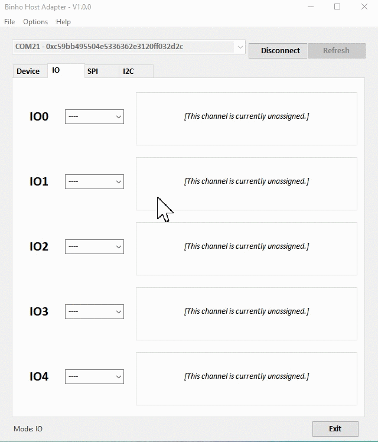
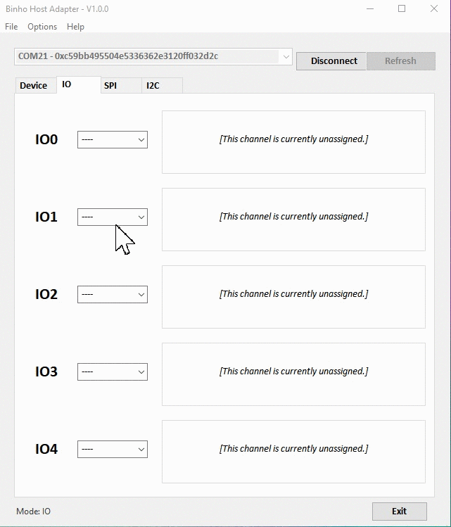
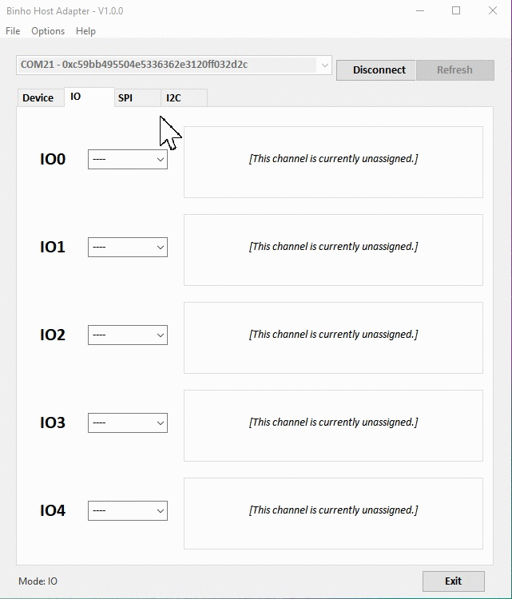

# IO in Mission Control

The five IO pins of the _Binho Nova Multi-Protocol USB Host Adapter_ can be used in a variety of modes, and unassigned pins can be used for their IO functions even when other pins are used for SPI or I2C operation. The image below shows the pinout and functionality of each of the pins:

### Digital Input

All 5 of the IO pins can be used as digital inputs. This can be achieved by selecting "DIN" from the pin assignment dropdown box. In this mode, the value of the input signal can be read by clicking the "Update" button. The value is displayed as either a logical 0 or 1.

### Digital Output

All 5 of the IO pins can be used as digital outputs. This can be achieved by selecting "DOUT" from the pin assignment dropdown box. In this mode, the value of the output signal can be set by clicking either the "Set Low" or "Set High" buttons.

### Analog Input

All 5 of the IO pins can be used as analog inputs. This can be achieved by selecting "AIN" from the pin assignment dropdown box. In this mode, the value of the input signal can be read by clicking the "Update" button. Note that the voltage reference is 3.3 Volts. The measured value is displayed in Volts.

### Analog Output

Only IO1 is capable of functioning as an analog output. This pin can be configured to use the 10-bit DAC to output a voltage between 0 and 3.3 Volts. IO1 can be set as an analog output by setting "AOUT" from the pin assignment dropdown box. In this mode, the value of the output signal can be set by dragging the slider from 0 to 1024. Note that the output signal is updated only after releasing the slider.

### PWM

IO0, IO2, IO3, and IO4 pins have PWM output capabilities. The duty cycle and frequency are both controllable from the software. This can be achieved by selecting "PWM" from the pin assignment dropdown box. In this mode of operation, the frequency can be set from 750Hz to 80kHz by dragging the top slider, and the duty cycle can be set by dragging the bottom slider from 0 to 1024. Please note that IO0 and IO2 share a frequency, and IO3 and IO4 share a separate frequency. As such, updating the frequency slider for one of these channels will also update the corresponding channel's frequency setting.


Please disregard the "%" label next to the duty-cycle value display in the animations above. This bug was fixed in V1.0.5 release of our software.

