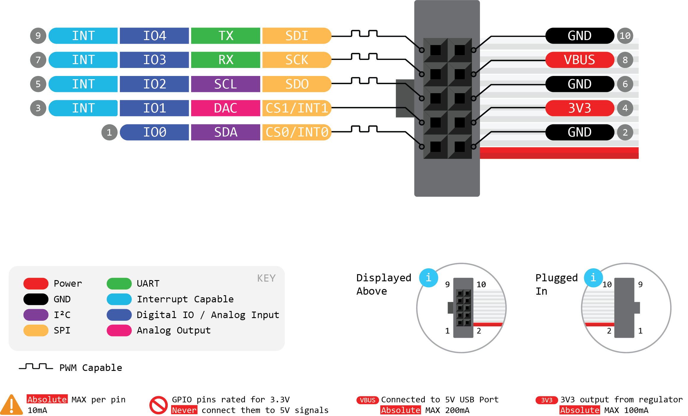
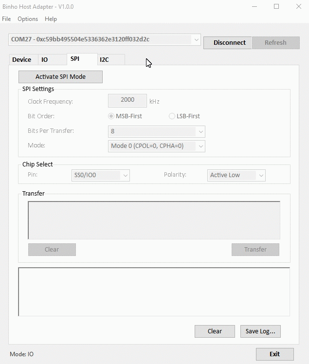

# SPI in Mission Control

The diagram below shows the pin assignments \(in yellow\) for the SCK, SDI, and SDO pins on the _Binho Nova Multi-Protocol USB Host Adapter_ when it is in SPI mode.

### Configuring the SPI Bus Settings

Once the SPI mode of operation has been activated by clicking the "Activate SPI Mode" button on the SPI tab, the SPI settings will be unlocked and ready for configuration.

The _Binho Nova_ supports SPI bus clock frequencies from 500kHz to 12MHz, and all four SPI modes are supported. Data can be configured for MSB or LSB first bit orders and for 8 or 16 bits per transfer.

Finally, configure the Chip Select signal, which can be active high or active low, to be either on the IO0 or IO1 signals.

### Sending & Receiving Data

Since SPI is a full-duplex communication protocol, the process of sending and receiving data is identical, and is simply referred to as "transfer" from within our software. To transfer data from the host adapter to a SPI peripheral device, simply enter in the data into the textbox and click the "Transfer" button. Data can be typed in binary, decimal, or hex formats. In the case of binary, the 8bit value should be preceded by a prefix of "0b", likewise a hex value should be preceded by "0x". Numbers without a prefix will be evaluated as a decimal number.

For clarity, here is an example of a valid data transfer displayed in each of the three supported bases:

Decimal: `222 173 190 239`

Binary: `0b11011110 0b10101101 0b10111110 0b11101111`

Hex: `0xDE 0xAD 0xBE 0xEF`

You can find the results of the transfer displayed in the transaction list at the bottom of the window.

Note that reading data from a SPI peripheral device can be achieved by transfer bytes of value 0 for the desired number of bytes to be read back. This is how the SPI controller clocks out data from the SPI peripheral device.

