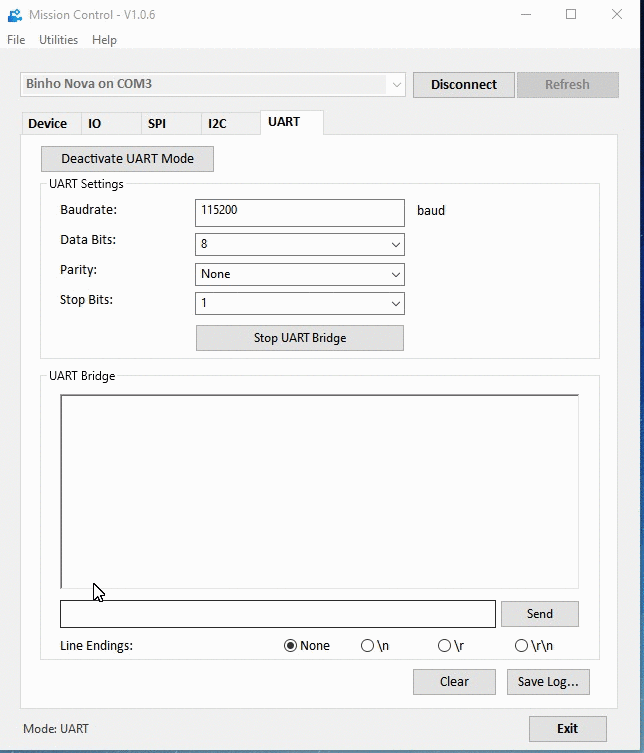

# UART in Mission Control

The diagram below shows the pin assignments \(in green\) for the TX and RX pins on the _Binho Nova Multi-Protocol USB Host Adapter_ when it is in UART mode.

### Configuring the UART Settings

Once the UART mode of operation has been activated by clicking the "Activate UART Mode" button on the UART tab, the UART settings will be unlocked and ready for configuration.

The _Binho Nova_ supports UART baud rates from 300bps up to 1000000bps. The UART bus can be configured for 5, 6, 7, or 8 bit data packets; Even, Odd, or no Parity bit; and to use 1 or 2 stopbits. 

### Starting & Stopping the UART Bridge

Once the settings for the UART bus have been configured, click the "Start UART Bridge" button to begin transacting on the bus. Note that when the UART Bridge is started, the caption of the button will change to "Stop UART Bridge". The UART Bridge must be stopped before performing any other interactions with the Binho Nova.

### Transmitting Data

Data can be transmitted on the UART bus by typing it into the text box and clicking the **Send** button. By default, no line endings are used when sending the entered text. However, it's very common for lines to be terminated by `\n`, `\r`, or `\r\n` so any of these options can be configured using the radio buttons below the **Send** button.

### Receiving Data

Data received on the UART bus will be displayed in the console as it arrives.

