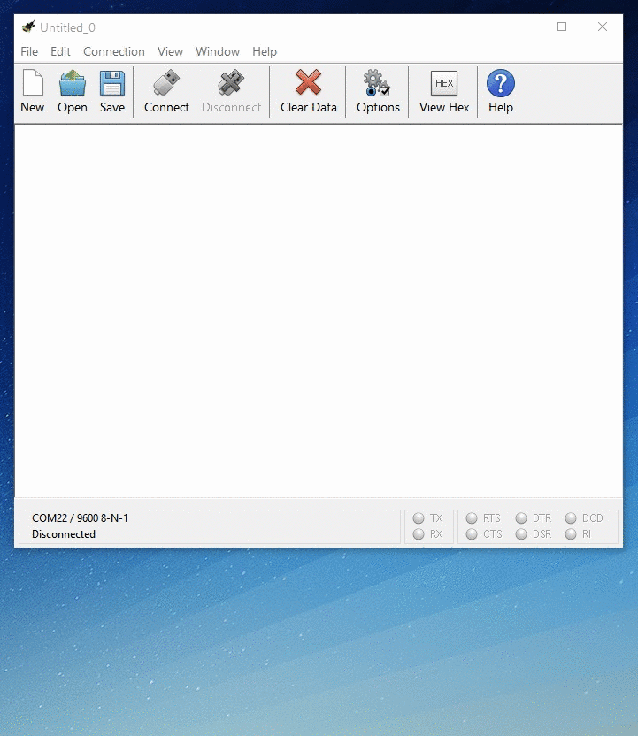
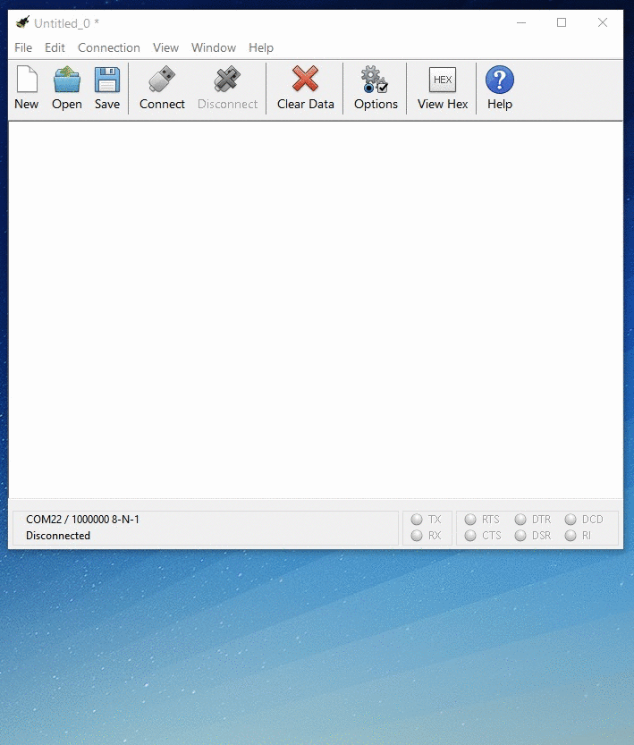
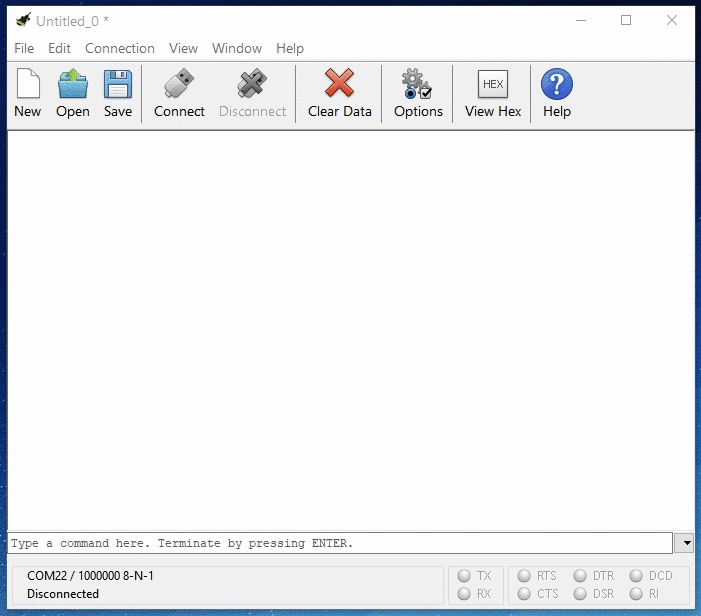
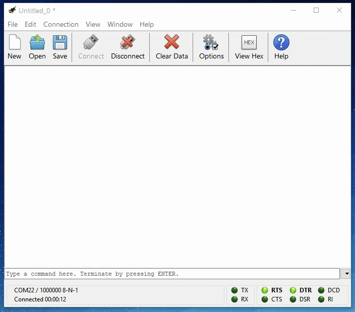

# QuickStart with CoolTerm

### Step \#1: Download and Install CoolTerm

CoolTerm is a very popular cross-platform serial console application developed by Roger Meier. It's got all the necessary features for communicating with hardware devices and an elegant user interface.

You can [download the latest release](https://freeware.the-meiers.org/) directly from his website. Installation simply entails extracting the folder from it's compressed .zip archive and placing in a known location on your drive.

### Step \#2: Connect the Binho Multi-Protocol USB Host Adapter

Connect the _Binho Nova_ to your PC using the provided USB cable. The status LED on the host adapter will shine yellow when it is powered and waiting for the host PC to open the connection to the device.

### Step \#3: Configure the Serial Connection

Configure the serial connection by clicking the "Options" button on the toolbar.

The connection parameters should be configured to the following:

* **Baudrate**: 1000000
* **Databits**: 8
* **Parity**: None
* **Stop Bits**: 1
* **No Flow Control**


Due to the nature of the virtual serial connection, the actual baudrate setting does not have any effect on device performance. However, a million of something always feels great, even if it's just bits per second.


Now let's adjust some CoolTerm settings to make it even easier to use.

1. Click the "Options" button again and select the "Terminal" Category from the list on the left.
2. Change the "Terminal Mode" setting from "Raw Mode" to "Line Mode"
3. Select the checkbox to enable "Local Echo" functionality. 

### Step \#4: Open the Serial Connection

Now that the connection parameters have been configured correctly, it's time to connect to the _Binho Nova._ Click the "Connect" button on the toolbar to open the serial connection.

Once the serial connection has been established, the Status LED on the _Binho Nova_ will shine _blue_. You can now begin sending commands to the host adapter.

### Step \#5: Send Commands

Sending commands to the device is as simple as typing a command and pressing Enter. Let's get the unique device ID of this host adapter by sending the device command `+ID`.

Note that the host adapter will respond to every command. If you do not receive a response from the command, then the serial connection may not be configured properly.

You're ready to hit the ground running. Check out the full User Guide to learn how to take advantage of the full set of supported protocols and features of your host adapter:













