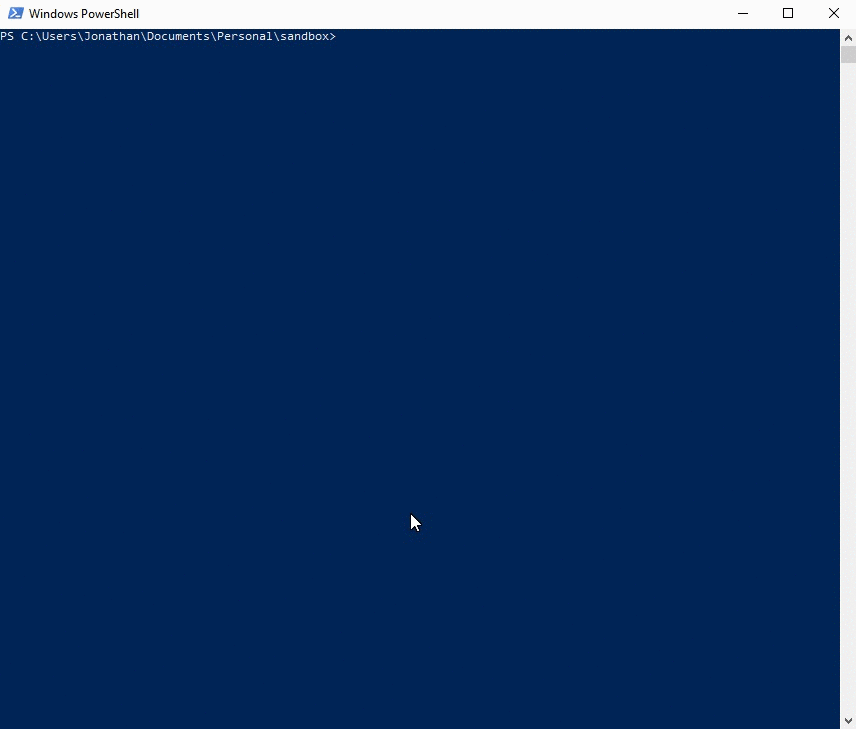

# QuickStart with Python

We've released python libraries to make it lighting fast to start automating test and development tasks with a _Binho Nova Multi-Protocol USB Host Adapter._&#x20;

### Step #1: Download and Install Binho Python Package

The easiest way to get started is to install this library using pip:

```
pip install binho
```

### Step #2: Try out the Command Line Interface

The installation of this library also includes the new command line interface which makes it possible to perform a lot of common functions without needing to write any code. The format of the commands is as follows:

```
binho <<subcommand>> [arguments]
```

The first command we'll try is the 'binho info' command, as it will look for any connected Binho host adapter and display it's COM port, device ID, and firmware version:

```python
PS C:\Users\Jonathan> binho info
Found a Binho Nova
  Port: COM3
  Device ID: 0X1C4780B050515950362E3120FF141C2A
  Firmware Version: 0.2.5 [Up To Date]

```

This is a great way to ensure everything is setup and working as expected. There are command line tools for nearly every feature of Binho Nova including performing I2C, SPI, and 1-Wire transactions right from the terminal. You can learn all about them [here](https://support.binho.io/python-libraries/binho-python-package#command-line-interface).

### Step #3: Run and review example scripts

Take a look in the [/binho/examples](https://github.com/binhollc/binho-python-package/tree/main/binho/examples) folder of the codebase (hosted on github) to see example scripts which demonstrate how to use this library in your own scripts to automate Nova. These example scripts feature a lot of commentary and serve as a tutorial for using this library.

The [Hello World LED](https://github.com/binhollc/binho-python-package/blob/main/binho/examples/00\_hello\_world\_led.py) example is a perfect place to start, as it demonstrates how to connect to the device as well as look for exceptions making it very robust.&#x20;

### Step #4: Write a custom script

Using Nova in your scripts is as simple as importing the library:

```python
import binho
```

Then initialize a connection to the binho device as such:

```python
# grab the first device found the system finds
binho = binhoHostAdapter()
```

When working on setups with multiple devices, you can specify the device to connect to in the following 3 ways:

1. grab the device with a specific index\
   `binho = binhoHostAdapter(index=0)`
2. or get the device using the COM port\
   `binho = binhoHostAdapter(port=targetComport)`
3. or get the device using the deviceID number\
   `binho = binhoHostAdapter(deviceID = targetDeviceID)`

At this point it's possible to control the device as desired. Examples of common use cases are included in this library and are briefly discussed below. When you're done with the device, be sure to close out the connection with the following:

```
binho.close()
```

That's all there is to it. The example scripts are introduced below, but it may also make sense to review the new Command line interface as well, as it may be possible to achieve your goals without writing any code at all.

You can find more in-depth details about our Python library here:


[binho-python-package.md](../python-libraries/binho-python-package.md)


## Using our Legacy Python Wrapper

The packaged releases contains two libraries:

#### binhoHostAdapter

This library is essentially a wrapper for all of the commands presented in the [ASCII Command Set ](https://support.binho.io/user-guide/ascii-interface)documentation. The library is written in such a way to support multiple devices as well as [properly handling INTERRUPTS](https://support.binho.io/user-guide/using-the-device/receiving-interrupts) by making use of threads.

#### binhoUtilities

This library provides a handful of functions which aid in device management, as in identifying COM ports and _Binho_ devices attached to the host computer.

### Step #1: Download and Install the Binho Host Adapter Libraries

The officially-supported Python library can easily be installed using pip:

```bash
pip install binho-host-adapter
```

This library is cross-platform and is intended for use with Python 3.x. Source code can be found [here](https://bitbucket.org/binho-llc/usb-host-adapter-python-libraries/src/master/).


### Step #2: Find Connected Devices

Let's use the [binhoUtilities ](../python-libraries/python-wrapper/binhoutilities.md)class to find devices attached to this computer. Start by creating a new python script, call it `binhoDemo.py`, and enter the following code:


```python
from binhoHostAdapter import binhoUtilities
from binhoHostAdapter import binhoHostAdapter

utilities = binhoUtilities.binhoUtilities()
devices = utilities.listAvailableDevices()

print('Binho Host Adapters Found On The Following Ports:')
print(devices)
```


Make sure your device is plugged in and then run the script. A list of ports where Binho devices have been found will be printed to the screen.



### Step #3: Connect to a Device

Now that you know how to use the `binhoUtilities` class to discover devices, let's extend the script to connect with the first device it discovers. We'll leave a comment where we'll implement our desired functionality later in Step #4, and then just immediately close the connection and exit.


```python
from binhoHostAdapter import binhoUtilities
from binhoHostAdapter import binhoHostAdapter

utilities = binhoUtilities.binhoUtilities()
devices = utilities.listAvailableDevices()

print('Binho Host Adapters Found On The Following Ports:')
print(devices)
print()

# Make sure at least one binho device was found before proceeding
if len(devices) < 1:
    print('No Binho Host Adapter found...Quitting script')
    exit(1)

# Target the port of the first device in the list
targetPort = devices[0]
print('Connecting to host adapter on ' + targetPort)
print()

# Connect to the binho device on the target port
binho = binhoHostAdapter.binhoHostAdapter(targetPort)
print('Connected!')
print()

#
# Here's where we'll implement our desired functionality, see Step #4
#

# Close the connection to the device before exiting
binho.close()
print('Connection closed!')
print()

# Exit gracefully
exit(0)
```



### Step #4: Interact

Now that we have a basic script which handles device discovery, connection, and disconnection, all that's left to do is implement our desired functionality. The simple example below shows how to generate a PWM signal on IO0.


```python
from binhoHostAdapter import binhoUtilities
from binhoHostAdapter import binhoHostAdapter

utilities = binhoUtilities.binhoUtilities()
devices = utilities.listAvailableDevices()

print('Binho Host Adapters Found On The Following Ports:')
print(devices)
print()

# Make sure at least one binho device was found before proceeding
if len(devices) < 1:
    print('No Binho Host Adapter found...Quitting script')
    exit(1)

# Target the port of the first device in the list
targetPort = devices[0]
print('Connecting to host adapter on ' + targetPort)
print()

# Connect to the binho device on the target port
binho = binhoHostAdapter.binhoHostAdapter(targetPort)
print('Connected!')
print()

# Set the LED color to GREEN
binho.setLEDColor('GREEN')
print('Set LED to Green')
print()

# Set the operation mode to IO
binho.setOperationMode(0, 'IO')

# Set IO0 to PWM mode
binho.setIOpinMode(0, 'PWM')

# Set IO0 PWM Frequency to 75kHz
binho.setIOpinPWMFreq(0, 75000)

# Set IO0 PWM duty cycle to 512/1024
binho.setIOpinValue(0, 512)
print('IO0 set to PWM with 50% duty cycle / 75kHz frequency')
print()

# Close the connection to the device before exiting
binho.close()
print('Connection closed!')
print()

# Exit gracefully
exit(0)
```



### Going Further

We've just covered the most basic case of using the Python libraries to automate your _Binho Nova_. The full documentation of the python libraries can be found here:


[python-libraries](../python-libraries/)


And example Python scripts which demonstrate all of the various protocols and features of the _Binho Nova_ can be found here:


[examples](../python-libraries/python-wrapper/examples/)

