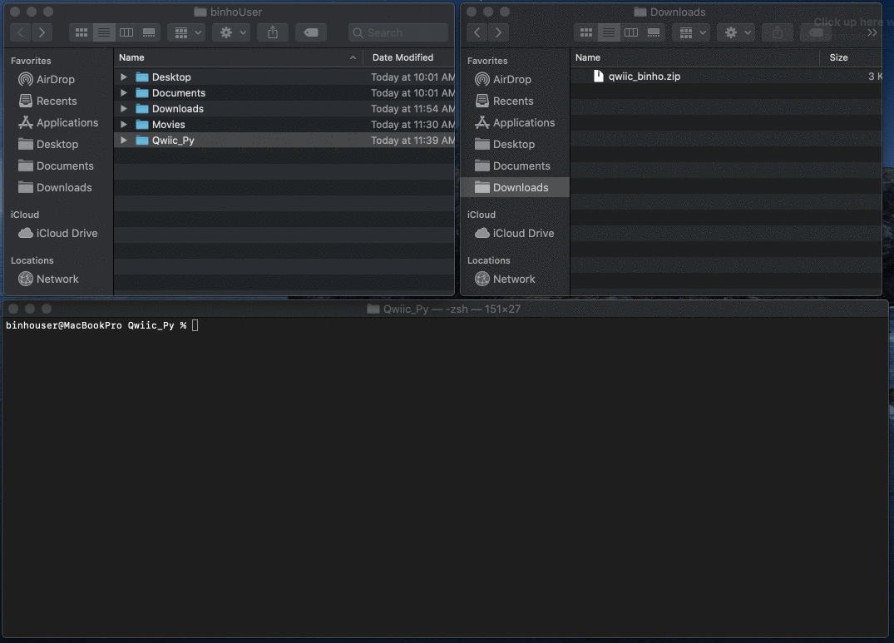
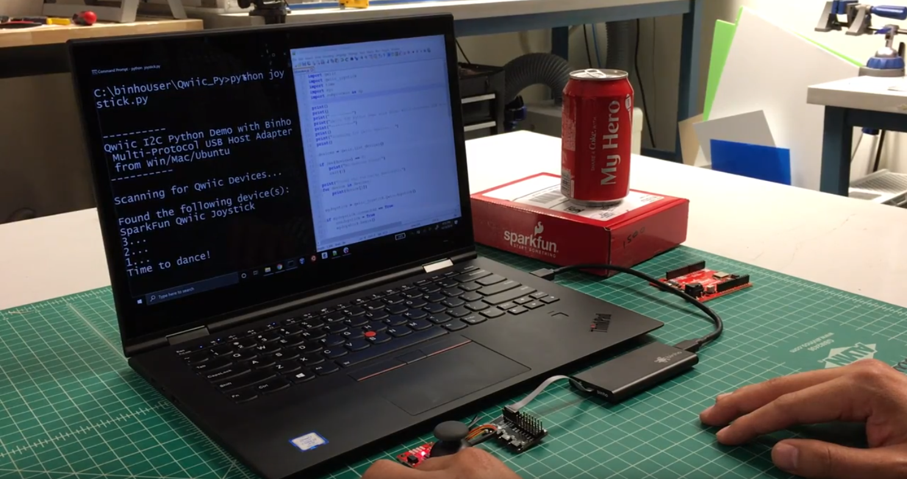
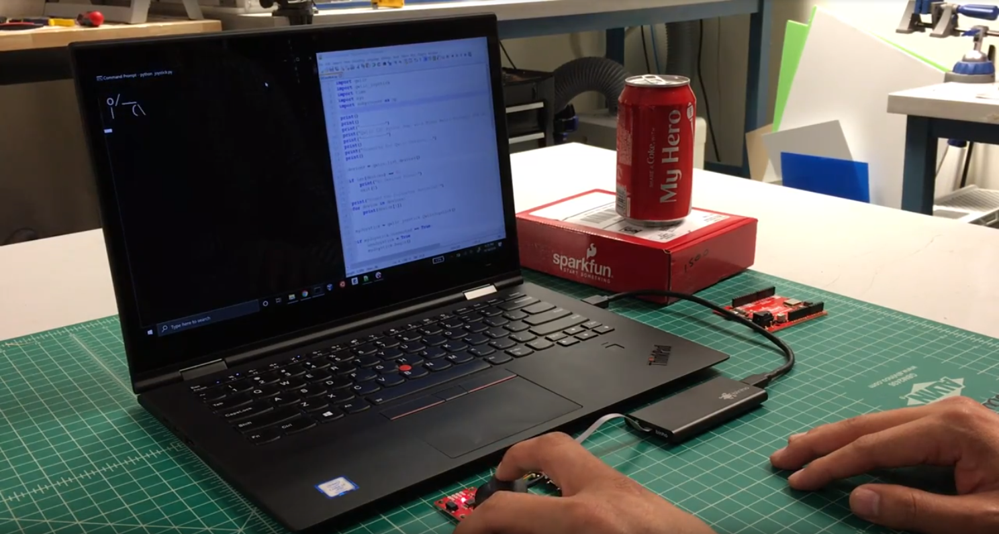

# Binho + Sparkfun Qwiic\_Py

The _Binho Multi-Protocol USB Host Adapter_ makes it extremely easy to directly interface with [Sparkfun Qwiic](https://www.sparkfun.com/qwiic#products) devices with your computer. With their newly released [Qwiic\_Py python package](https://github.com/sparkfun/Qwiic\_Py), it's possible to use the same python drivers written for Raspberry Pi, Nvidia Jetson Nano, and the Google Coral also from your computer running Windows, MacOS, or Ubuntu.

The demo below uses the _Binho Multi-Protocol USB Host Adapter_ to interface the [Sparkfun Qwiic Joystick](https://www.sparkfun.com/products/15168) directly to a laptop using Sparkfun's [Qwiic\_Joystick\_Py](https://github.com/sparkfun/Qwiic\_Joystick\_Py/tree/7cce263c1098a7b3f48c488e615a27dbe8ea2ea7) driver, which is already part of the Qwiic\_Py python package as a submodule.


Now that you've seen the end result, let's look at how simple it is to achieve!

### Materials

This demo was built using the _Binho Multi-Protocol USB Host Adapter_ along with the Qwiic Interface Board, both of which can be purchased from our website. We're also using the Sparkfun Qwiic Joystick and a 100mm Qwiic Cable, which can be purchased from the Sparkfun website.









### Software Setup

Setting up the demo is quite simple. The following steps are used to add the I2C driver for the _Binho Multi-Protocol USB Host Adapter_ into the Qwiic\_Py package and then register the new driver so that it will be used by default when python determines that it's being run on a Windows, MacOS, or Ubuntu system.


We'll be making a pull request on Sparkfun's official repository for this project, and if accepted, the _Binho _driver will come already setup and this process can be omitted. However, for now, the easiest way to set this up is to use our git patch detailed below.


#### Prerequisite

The following process presumes that you already have python3 installed on you computer.

#### Step 1: Clone the Sparkfun Qwiic\_Py Repo

Start off by downloading a local copy of the source code for the Sparkfun Qwiic\_Py repository. You can do this by issuing the following command:

```bash
git clone https://github.com/sparkfun/Qwiic_Py.git
```

This repository makes use of `git submodules` to include the code from additional repositories as part of the package. As such, we need to pull in the code for those submodules as well using the following commands:

```bash
cd Qwiic_Py
git submodule update --init
```

Now we've got all the source files for the Qwiic\_Py python package on our local machine.

#### Step 2: Download & Extract the Patch

Download the following zipped directory and extract it's contents. This includes the driver as well as the example python script shown in the demo video at the top of this page.


Qwiic\_Py Binho Driver Package


#### Step 3: Copy & Paste

Copy and Paste the contents of the extracted zip directory into the `Qwiic_Py/qwiic_i2c/qwiic_i2c/` directory.

#### Step 4: Apply the Patch

In order to register the new Binho\_I2C.py driver with the Qwiic\_Py package, we need to add a few lines of code to the `qwiic_i2c/__init__.py` file in the repository as well. We created a git patch to make this as streamlined as possible.

Apply the patch by opening up a git console, navigating to the `Qwiic_Py/qwiic_i2c/qwiic_i2c/` directory and issuing the following command:

```bash
git apply qwiic_binho.patch
```

#### Step 5: Reinstall the Qwiic\_Py package

In order to ensure the new local changes to the package get applied globally (equivalent to doing a `pip install` of the package), we need to do the equivalent installation again.

First, step up a directory into qwiic\_i2c folder and install that submodule:

`python setup.py install `

Then step up once again to the Qwiic\_Py root directory and install that package:

`python setup.py install `


MacOS may require sudo: `sudo python setup.py install`


**Congratulations!** At this point, the update to the Sparkfun Qwiic\_Py package is complete! Now you can use any of the Sparkfun Qwiic\_Py python drivers from your computer! If you had any trouble getting things setup, please have a look at the screen captures below for visual reference of the process detailed above.

For easy reference, the following GIF demonstrates steps 3 - 5 on a Windows PC:


And here's how the same setup process looks on MacOS:



### Hardware Setup

The hardware setup is simply connecting each of the devices together. The Binho Multi-Protocol USB Host Adapter connects to your computer using the provided USB cable. Connect the wire harness of the Binho host adapter to the Qwiic Interface board, and then use the 100mm Qwiic cable to connect the Sparkfun Qwiic Joystick board to the Qwiic Interface board. The entire setup can be seen in the photo below.


### Running the Demo

The demo script can be found in the root directory of the Qwiic\_Py project. If you left the terminal open from the setup process detailed above, you'll find yourself already in the correct location.&#x20;

On Windows, execute the following command:

```bash
python joystickWindows.py
```

On MacOS or Ubuntu, run this command:

```
python joystickMac.py
```

You'll immediately see a title and some status information printed to the terminal, ending with a 3 second countdown timer, as shown in the image below.



Our ASCII Dance Man can then be manipulated by moving the joystick along it's X or Y axis.



### Going Further

All of the code for the demo can be found in our clone of the Qwiic\_Py repo on [our Github page](https://github.com/binhollc/Qwiic\_Py).

The most interesting parts to review are the Binho I2C driver, which can be found here:


binho\_i2c.py


and the actual demo python script which shows the use of the original Sparkfun Qwiic Joystick Python Driver, which can be found here:


joystickWindows.py


Questions, Comments, and Feedback are always welcome! Please feel free to write in at _support@binho.io_.
