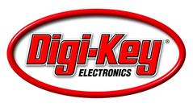
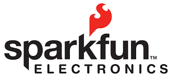
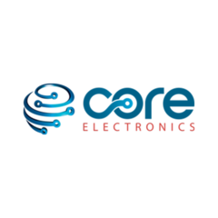
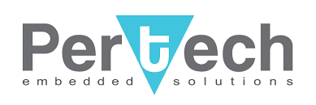

# Distributors

We're in the process of developing a world-wide network of reputable distributors. If you're interested in becoming an official distributor of Binho products please fill out [this form](https://forms.gle/AJkLwm19QSuzFV8EA) and we'll be reaching out to you shortly.

## Authorized Distributors

### USA

### Australia

### South Korea

### China / Hong Kong / Taiwan

_Also serving Malaysia, Singapore, and Vietnam_

### Europe

#### Sweden

Serving the EU and nearby markets including the UK and Russia.

#### Norway

### Israel

### United Kingdom

