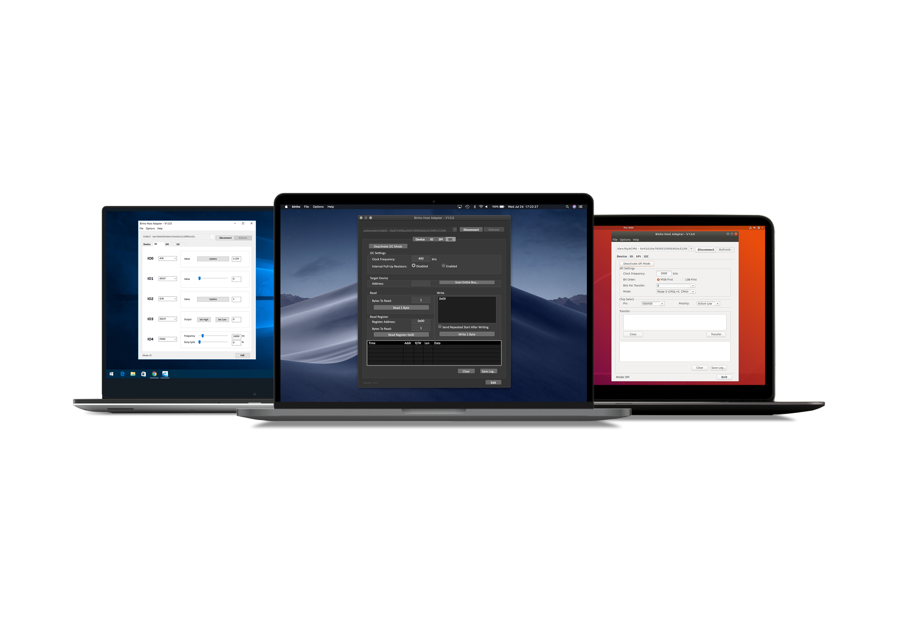

# Mission Control Software

Our cross-platform software is available for Windows, Mac, and Linux and provides an easy-to-use GUI interface for your _Binho Nova Multi-Protocol USB Host Adapter_.

Mission Control features support for SPI, I2C, and UART protocols, as well as IO functions.

You can download the latest version for your operating system here:


[releases](releases/)


Take a look at the Getting Started section of our support portal for an introduction to using our GUI software:


[quickstart-with-binho-gui](../getting-started/quickstart-with-binho-gui/)


### Device Tab

.png>)

### IO Tab

.png>)

### SPI Tab

.png>)

### I2C Tab

.png>)

### UART Tab

.png>)
