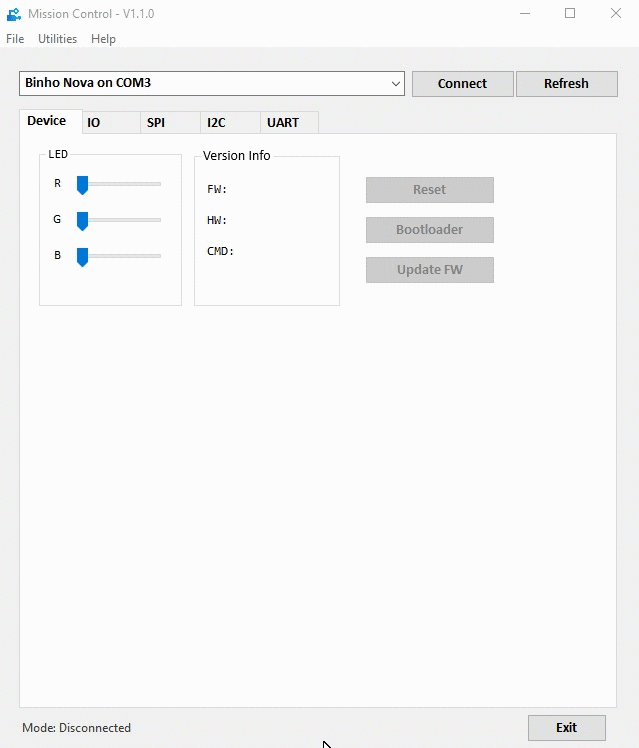

# How To Update Firmware

Mission Control automatically detects the firmware version of a connected Binho Nova and checks if there's a newer version available. If a newer version of firmware is found, a prompt will be displayed asking if you'd like the device firmware to be updated. This process is shown below:


Disk Drive Encryption Software (such as BitLocker) will likely prevent the firmware update process of completing successfully. An upcoming release of Mission Control will include the necessary functionality to resolve this issue.&#x20;



The automatic firmware update process shown above will only work on computers which have an active internet connection. In order to update devices which are part of test stations that do not have an active internet connection, please see the Manual Firmware Update process [here](https://support.binho.io/user-guide/using-the-device/updating-firmware#manual-update).


This process is described in more detail, along with a brief video demonstration of this process on the following support page:


[updating-firmware.md](../../user-guide/using-the-device/updating-firmware.md)

