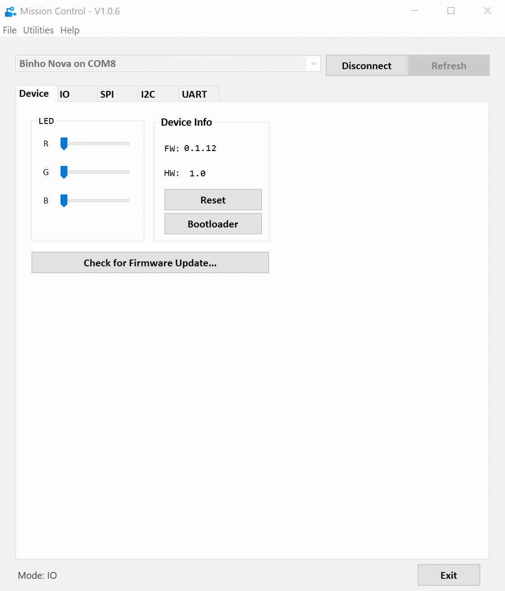
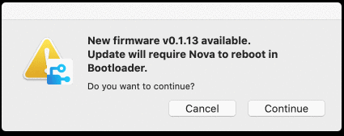

# How To Update Firmware

### Step \#1: Connect to Binho Nova

### Step \#2: On the Devices Tab, Click "Check for Firmware Update

### Step \#3: Select "Continue" from the Dialog Box

### Step \#4: Done

