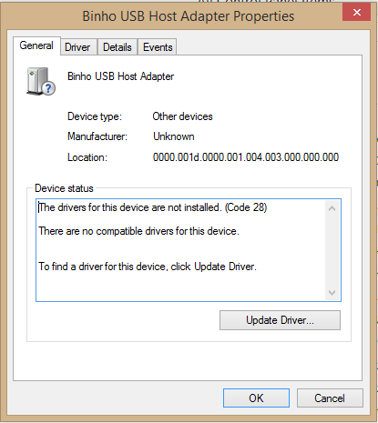
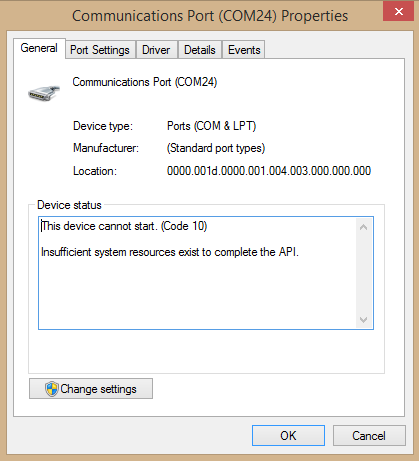
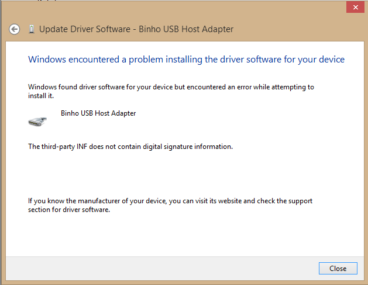

# Windows 8 Driver Problems

In rare situations, there might be problems with the drivers on Windows 8 which require manual intervention in order to get the device working the first time that it's connected to the PC. These issues manifest themselves with the following 2 error codes displayed in Windows Device Manager.

### Code 28 - The drivers for this device are not installed.

### Code 10 - The device cannot start.

Both of these error messages indicate an issue with the device driver that's been associated with the Binho Nova host adapter. Thankfully this can be resolved by manually updating the device driver.

Our device drivers are not digitally signed, therefore should you need to manually install the drivers on Windows 8, you'll need to first temporarily disable the digital signature enforcement and then peform the installation. Our friends at SparkFun have produced a pretty clear guide to disabling Windows 8 Driver Signature Enforcement. Please follow the steps [here](https://learn.sparkfun.com/tutorials/disabling-driver-signature-on-windows-8/disabling-signed-driver-enforcement-on-windows-8).

Once the driver signature enforcement has been disabled, please follow the same steps presented on the Windows 7 Driver Installation page to manually install the driver:



Note that if you do not following the steps to properly disable device driver signature enforcement, you will likely encounter the following error message when trying to update the device driver:

