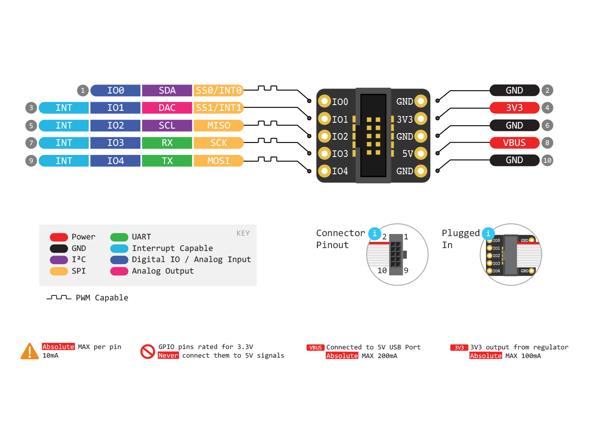

# Breadboard Breakout

This board features a male 2x5 1.27mm connector and breaks it out to breadboard-friendly 2.54mm / 0.1in pitch headers. It's a quite easy way to interface your Binho host adapter with other circuits using standard jumper wires as well. The board measures 14mm x 18mm x 7mm and is black with white silkscreen labels for each of the pins. The SMT connector comes soldered to the board but you'll need to install the headers \(included\) yourself.


Note that each _Binho Multi-Protocol USB Host Adapter_ includes one of these adapters.


These are available for purchase on our website [here](https://binho.io/collections/accessories/products/breadboard-breakout).

### Breadboard Breakout Pin Diagram

