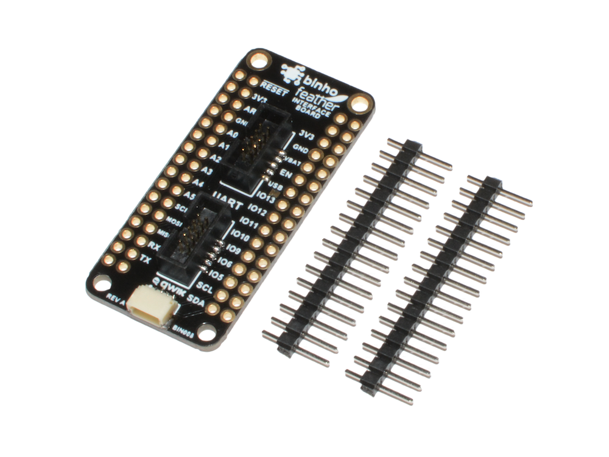

# Feather Interface Board

This board makes it easy for you to interface your _Binho Nova_ host adapter with any [Adafruit Feather](https://www.adafruit.com/feather) form-factor device. I2C, SPI, and UART interfaces are all wired up. By default, the 3V3 and 5V rails are connected so that the Binho Nova can power the sensors, but this can be easily disabled by cutting the exposed traces. Additionally, this interface board features a Qwiic connector to easily bridge the Feather and Qwiic ecosystems. The headers are included but not installed.

**Note:** We highly recommend the [FeatherWing Doubler](https://www.adafruit.com/product/2890) from Adafruit for use with this board.

This accessory is available for purchase in our online store [here](https://binho.io/collections/accessories/products/feather-interface-board).

