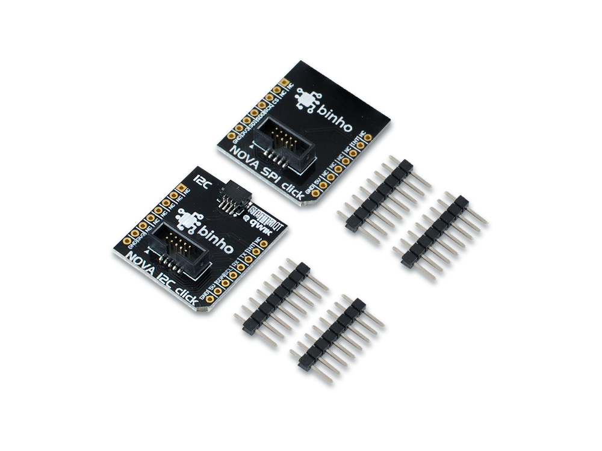

# mikroBUS Click Pack

These boards make it easy for you to interface your Binho Nova directly to any I2C, SPI, or UART bus on boards which feature [mikroBUS](https://www.mikroe.com/mikrobus) Click sockets. Additionally, the Nova I2C Click includes a Qwiic connector, so that you can easily connect your favorite qwiic breakout devices to your mikroBUS-enabled board. Each Click Pack includes 1 x Nova SPI Click and 1 x Nova I2C Click. The headers are included but not installed.

This accessory is available for purchase in our online store [here](https://binho.io/collections/accessories/products/mikrobus-click-pack).

