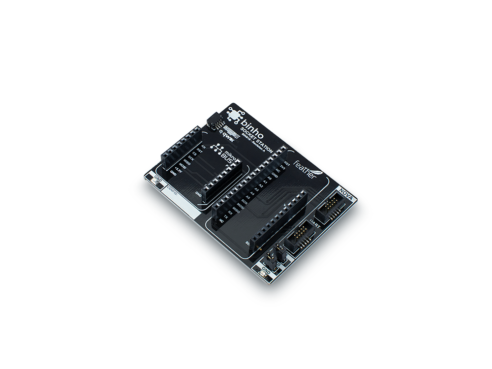

# Socket Station

The Binho Socket Station provides the most convenient way to combine devices from your favorite form-factors and ecosystems in an elegant way. The board features sockets for a mikroBUS click and a Feather, as well as a Qwiic / StemmaQT connector to interface your favorite I2C devices. There are two ground loops soldered at the corners for easy signal probing with your scope or DMM. And of course, there's connectors to connect your Binho Nova to the SPI, I2C, and UART buses that interconnect these devices. The 3V3 and 5V power rails can be sourced by the attached Binho Nova, or can be isolated from the Nova via jumpers.

The silkscreen on the back of the PCB clearly shows the wiring between the Feather and mikroBUS click sockets for easy reference, and the board sits on 4 x bump-on feet to protect your desk. This board comes fully soldered and ready for action.

This accessory is available for purchase in our online store [here](https://binho.io/collections/accessories/products/mikrobus-click-pack).
