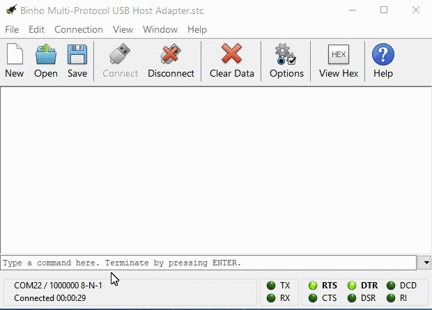
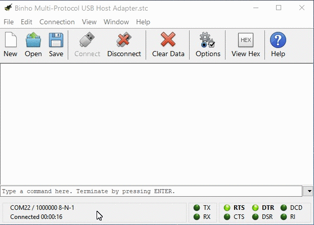

# Device Settings

The first set of commands covered in this guide are the "Device" commands. These commands are not related to any particular protocol or feature, rather they configure general functionality of the host adapter.&#x20;


This section of the User Guide is presented in the format of a "Programmer's Guide" to demonstrate how the commands can be used to achieve certain functionality. A full "Language Reference" format of the commands can be found [here](https://support.binho.io/user-guide/ascii-interface).


Functions related to the communication, setting the host adapter mode of operation, identifying the device, and resting the device can all be accomplished using the Device commands.


All Device commands begin with +.


### Communication / User Interface

There are a few commands that aid in the communication between the host adapter and the computer and can improve the clarity of the user experience by tailoring it to the current test session needs.

| Command   | Description                                                                                                                                                                                                                         | Link                                                                                |
| --------- | ----------------------------------------------------------------------------------------------------------------------------------------------------------------------------------------------------------------------------------- | ----------------------------------------------------------------------------------- |
| **+ECHO** | Toggles the status of the host adapter's echoing back of received characters. This is useful for manual control when the serial console application does not provide local echo functionality.                                      | [Details](https://support.binho.io/user-guide/ascii-interface/device-commands#echo) |
| **+PING** | Returns an ACK response, useful in testing the status of the serial connection.                                                                                                                                                     | [Details](https://support.binho.io/user-guide/ascii-interface/device-commands#ping) |
| **+BASE** | Gets/Sets the display base. The host adapter is able to use binary, decimal, or hex numeric bases for displaying values.                                                                                                            | [Details](https://support.binho.io/user-guide/ascii-interface/device-commands#base) |
| **+LED**  | Gets/Sets the color of the status LED. The RGB Status LED is user-programmable and can be especially helpful for indicating status during testing or identifying host adapters when multiple devices are being used simultaneously. | [Details](https://support.binho.io/user-guide/ascii-interface/device-commands#led)  |

### Operating Mode

One of the most important Device commands is the +MODE command, which is used to configure the operating mode of the host adapter. The supported operating modes are IO, SPI, I2C, 1-WIRE, SWI, and UART.

| Command   | Description                                 | Link                                                                                |
| --------- | ------------------------------------------- | ----------------------------------------------------------------------------------- |
| **+MODE** | Gets/Sets the mode of operation (protocol). | [Details](https://support.binho.io/user-guide/ascii-interface/device-commands#mode) |

### Device Management

There are three commands which aid in device management. These are particularly useful when working with multiple host adapters and when performing device firmware updates.

| Command    | Description                                                                                                                                                                       | Link                                                                                 |
| ---------- | --------------------------------------------------------------------------------------------------------------------------------------------------------------------------------- | ------------------------------------------------------------------------------------ |
| **+ID**    | Gets the globally-unique identifier of the host adapter. This identifier is very useful when working with multiple host adapters.                                                 | [Details](https://support.binho.io/user-guide/ascii-interface/device-commands#id)    |
| **+FWVER** | Gets the version of the firmware running on the host adapter. This can be used to determine if the latest firmware version is installed or if the host adapter should be updated. | [Details](https://support.binho.io/user-guide/ascii-interface/device-commands#fwver) |
| **+HWVER** | Gets the version of the host adapter hardware. This is useful to programmatically determine which host adapter product hardware is connected.                                     | [Details](https://support.binho.io/user-guide/ascii-interface/device-commands#hwver) |

### Reset / Update

It's possible to programmatically reset the device, similar to unplugging/plugging the device from the USB port. This returns all settings to their defaults and also causes the USB connection to drop and enumerate again. Note that the serial port on the host computer will need to be re-opened after the reset events.

| Command    | Description                                               | Link                                                                                 |
| ---------- | --------------------------------------------------------- | ------------------------------------------------------------------------------------ |
| **+RESET** | Resets the host adapter, all settings return to defaults. | [Details](https://support.binho.io/user-guide/ascii-interface/device-commands#reset) |
| **+BTLDR** | Resets the host adapter and restart in bootloader mode.   | [Details](https://support.binho.io/user-guide/ascii-interface/device-commands#btldr) |

The technical details of each of the commands, their parameters, and responses can be found in the ASCII Command Set Reference Guide:


[device-commands.md](../ascii-interface/device-commands.md)

