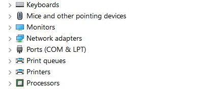
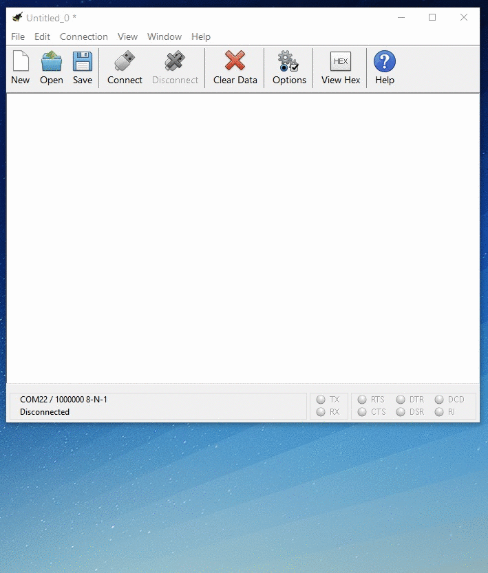
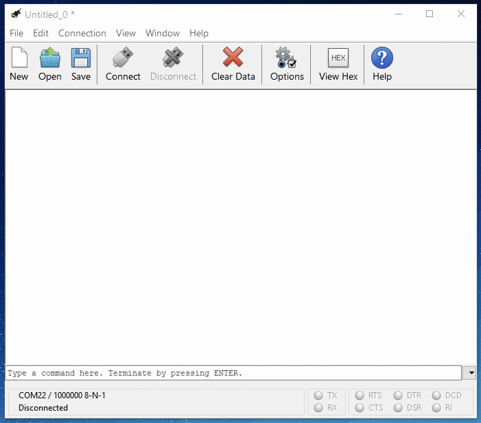
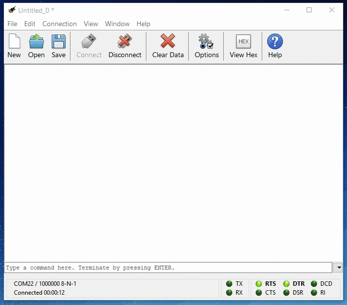

# Sending Commands

In order to begin interacting with the _Binho Nova Multi-Protocol USB Host Adapter_, you'll need to open up the connection to the device. As mentioned in the "Connecting the Hardware" section, the host adapter will enumerate as a Virtual COM port. Logically, the first step to connecting with it is to identify which port it is using.

### Identifying the Port

On Windows, this can most easily be determined by checking the device manager.

On Mac,

On Ubuntu,

### Configuring the Serial Connection

Now open up your serial console application and configure the connection parameters to the following:

* **Baudrate**: 1000000
* **Databits**: 8
* **Parity**: None
* **Stop Bits**: 1
* **No Flow Control**

.gif>)


Due to the nature of the virtual serial connection, the actual baudrate setting does not have any effect on device performance. However, a million of something always feels great, even if it's just bits per second.


### Pro-tip #1: Configure the Console Application For Easy Use

While this step is totally optional, it is quite the productivity boost to enable a few additional features which are particularly convenient when manually controlling your host adapter. In particular, you'll want to enable "Line Mode" and "Local Echo." Local Echo allows you to see the characters as you type them, and Line Mode tells the console to buffer the entered text until pressing Enter. Here's a quick look at how to configure these settings in CoolTerm:

### Opening the Connection

Now that the connection parameters have been configured correctly, it's time to connect to the _Binho Nova Multi-Protocol USB Host Adapter. _Click the "Connect" button to open the serial connection with the device.

Once the serial connection has been established, the Status LED on the _Binho Nova Multi-Protocol USB Host Adapter_ will shine _blue_. You can now begin sending commands to the host adapter.


The Status LED is user-programmable, so after initial power up and establishment of the serial connection, the Status LED color meaning is not correlated with any particular device state unless specifically set from within the test scripts.


### Sending a Command

With the open connection, Sending commands to the device is as simple as typing a command and pressing Enter. Let's get the unique device ID of this host adapter:

**Note that the host adapter will respond to every command.** If you do not receive a response from the command, then the serial connection may not be configured properly.


Commands **are not** case-sensitive.


The next page in this guide will discuss the format of the responses from the _Binho Nova Multi-Protocol USB Host Adapter._
