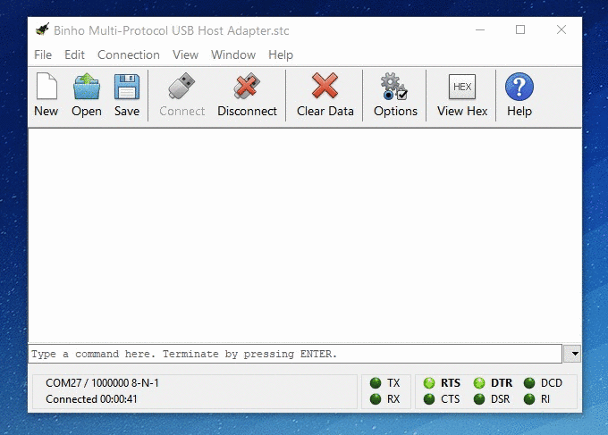

# Updating Firmware

The _Binho Nova Multi-Protocol USB Host Adapter_ is designed for ease of use in every aspect, and that's especially true when it comes to updating the device firmware. In an effort to provide the greatest flexibility in accommodating our different customers' development and testing environments, we offer a variety of ways to update the Nova device firmware. Below we detail how to update the firmware through three main methods: using Mission Control, using our python library, and manually using a Serial Terminal.


Please note that disk drive encryption software (such as BitLocker) will likely prevent the firmware update process of completing successfully. An upcoming release of Mission Control will include the necessary functionality to resolve this issue.&#x20;


## Updating Firmware through Mission Control

The easiest way to update your Nova device is through our Mission Control GUI software, which allows you to both automatically and manually update the device firmware. Watch the video below where we show how to automatically and manually update the device firmware through our Mission Control software.



### _Automatic Update_

### Step #1: Connect to the Binho Nova in Mission Control

From the drop down menu in the Device tab of Mission Control select the connect device you want to update and click the "Connect" button.

### Step #2: Click "Continue" to automatically update to latest firmware version

If your Nova device does not have the latest firmware already installed, a prompt will automatically appear when the device is successfully connected. To update your Nova device, simply click "Continue"


If you select "Cancel", you will still be able to use your Nova device. Firmware updates, while recommended, are not required.



If you select "Cancel" but still want to update your firmware, simply disconnect and reconnect to the desired Nova device.


### Step #3: Verify the firmware version in Device tab

After reconnecting to the newly updated device, you can verify the firmware version in the Device tab of Mission Control.

### _Manual Update_

### Step #1: Connect to the Binho Nova in Mission Control

From the drop down menu in the Device tab of Mission Control select the connect device you want to update and click the "Connect" button.

### Step #2: Click "Bootloader" in the Device tab

Clicking the "Bootloader" button in the Device tab of Mission Control resets the Binho Nova device into the bootloader. The device will then show up as a Mass Storage Device (similar to a USB drive or SD card) with a Volume Name of "BINHOBTLDR".

### Step #3: Download firmware file from Binho Support Portal

Download the firmware version that you want to load on to your Nova device from the Binho Support portal [here](../../firmware-releases/). The firmware file is downloaded as a .fig file.

### Step #4: Transfer the firmware file to the device

Now that the _Binho Nova Multi-Protocol USB Host Adapter_ looks like a storage device and you have downloaded the .fig file of the desired firmware, all one needs to do is save the firmware file (.FIG extension) to the drive. This is as simple as copy/paste or drag and drop. When a valid firmware file has been written to the drive, it will automatically restart in a few seconds.

### Step #5: Verify the Update

After reconnecting to the newly updated device, you can verify the firmware version in the Device tab of Mission Control.

## Updating Firmware through Python CLI


The Python command line interface shown below is part of our new library. Details [here](https://support.binho.io/python-libraries/binho-python-package).


### Step #1: Issue the firmware update command

With the Nova connected to your computer, simply issue the following command in a terminal/shell:

```
binho dfu -v --latest
```

This command will starts by querying our servers to see if there's a newer firmware version available. If the latest firmware is already installed, the command returns with a message confirming that the latest firmware is already on the device. Otherwise, it will downloaded the latest firmware file, reboot Nova into it's bootloader, and then load the new firmware onto the device automatically.

**Note 1**: This command can also be used to load a specific firmware version onto the device by removing the `--latest` flag and providing a version number using the `-r` parameter as shown below:

```
binho dfu -v -r 0.2.2
```

**Note 2**: Depending on your OS / configuration, you may see a file explorer pop up when Nova enters bootloader mode. This is because Nova's bootloader implements a mass storage device which looks like a removable drive was connected to the OS temporarily.&#x20;

### Step #2: Verify the firmware version

The firmware version can be verified with the `binho info` command:

```
binho info
```

This will return the firmware version currently running on the device, as show below:

```
Found a Binho Nova
  Port: COM3
  Device ID: 0X1C4780B050515950362E3120FF141C2A
  Firmware Version: 0.2.5 [Up To Date]
```

## Updating Firmware through Serial Terminal

### Step #1: Reset into the Device Bootloader

The first step is reboot the device into the bootloader. This is achieved simply by sending the [+BTLDR ASCII Command](https://support.binho.io/user-guide/ascii-interface/device-commands#btldr) to the device while it's connected to your host PC. This will immediately terminate the virtual comport connection. After a few seconds, the device will show up as new Mass Storage Device (similar to a USB drive or SD Card) with a Volume Name of "BINHOBTLDR".



### Step #2: Transfer the Firmware File to the Device

Now that the _Binho Multi-Protocol USB Host Adapter_ looks like a storage device, all one needs to do is save the firmware file (.FIG extension) to the drive. This is as simple as copy/paste or drag and drop. When a valid firmware file has been written to the drive, it will automatically restart in a few seconds.

### Step #3: Verify the Update

Once the device has restarted, simply open up the serial connection and verify the new firmware version by sending the [+FWVER ASCII Command](https://support.binho.io/user-guide/ascii-interface/device-commands#fwver).

That's all there is to it! We'll be releasing new functionality via firmware updates frequently, so be sure to check for new releases and update often. The firmware releases can be found here:


[firmware-releases](../../firmware-releases/)


