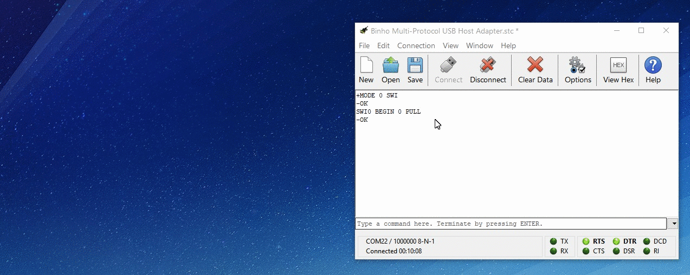

# Using SWI

The _Binho Multi-Protocol USB Host Adapter_ can function as an Atmel Single-Wire Interface\(SWI\) host device. This protocol can be configured to operate on any of the IO pins on the device, however it is especially convenient to use it on IO0 and IO2 as the internal pull-up resistor can be used thus eliminating the need for an external pull-up resistor.


Atmel has been a bit ambiguous with their use of the term "Single Wire Interface", with multiple incompatible versions of a protocol referred to in their documentation as "single wire interface". The SWI protocol presented here is the version commonly found on their CryptoAuthentication portfolio devices. It is not compatible with [AT21CSx1](https://www.microchip.com/wwwproducts/en/AT21CS01) devices.


The following table gives a brief overview of the available SWI commands. Of particular importance is the `PACKET` command and it's various sub-commands. There is much additional information in the details section of this command, but please stick around for the example on this page before jumping to the ASCII Command Set reference page.

| Command | Description | Link |
| :--- | :--- | :--- |
| **BEGIN** | Starts the Atmel SWI host on the given IO pin.  | [Details](https://support.binho.io/user-guide/ascii-interface/swi-commands#begin) |
| **TOKEN** | This command is used to send either a WAKE, ONE, or ZERO token. | [Details](https://support.binho.io/user-guide/ascii-interface/swi-commands#token) |
| **FLAG** | Send a COMMAND, TRANSMIT, IDLE, or SLEEP Flag. | [Details](https://support.binho.io/user-guide/ascii-interface/swi-commands#flag) |
| **PACKET** | Construct & Transmit a full data packet. | [Details](https://support.binho.io/user-guide/ascii-interface/swi-commands#packet) |
| **TX** | Transmit one byte of data on the SWI bus. | [Details](https://support.binho.io/user-guide/ascii-interface/swi-commands#tx) |
| **RX** | Receive n bytes of data on the SWI bus. | [Details](https://support.binho.io/user-guide/ascii-interface/swi-commands#rx) |

Feel free to jump ahead to the ASCII Command Set reference to learn the specifics of each command, or continue below to see an example of how to use these commands to achieve communication on the SWI bus.



### Setting Up the SWI Bus

The first step in using the _Binho Multi-Protocol USB Host Adapter_ as a SWI host is to put the adapter into SWI mode using the [Device Operating Mode](https://support.binho.io/user-guide/using-the-device/device-settings#operating-mode) command.

```text
+MODE 0 SWI
-OK
```

Now the host adapter is in SWI communication mode. Thankfully SWI has no configurable settings \(oh, the simplicity of a tightly defined protocol\), so all we need to do is decide which IO pin we want to use. Let's take advantage of the internal pull-up resistor on IO0:

```text
SWI0 BEGIN 0 PULL
-OK
```

And just like that, we're ready to start communicating.

### Sending and Receiving Data

Let's get started communicating with the SWI device by sending a WAKE token and reading back the device ID:

```text
SWI0 TOKEN WAKE
-OK

SWI0 RX 4
-SWI0 RXD 0x04 0x11 0x33 0x43
```

If you are following along at home, there's a good chance your interaction looked like this:

```text
SWI0 TOKEN WAKE
-OK

SWI0 RX 4
-NG
```

That's because the timeouts of these devices make it very challenging to interact with them manually. However it's not impossible! This is a perfect time to use the "Send String..." functionality of CoolTerm:



From the "Connection" menu, select "Send String..." or use the Ctrl-T shortcut to open up two Send String windows. Enter each command followed by return into the windows. Then simply click the Send button in each of them. This allows us to ensure our interactions with the SWI device aren't delayed by the time it takes to pluck everything in on the keyboard. Of course, automating these interactions with python or another scripting language avoids the need for these sort of hacks altogether.

Now we'll construct a full packet to transmit using the `PACKET` command and it's sub-commands. The first step in this process is setting the `OPCODE`:

```text
SWI0 PACKET OPCODE 0x02
-OK

SWI0 PACKET PARAM1 0x00
-OK

SWI0 PACKET PARAM2 0x0000
-OK
```

The packet also has two parameters, `PARAM1` is 8-bits, and `PARAM2` is a 16-bit value. They are both zero by default, so no need to configure them for this packet, but for the sake of demonstration they are shown above.

Now let's send the packet:

```text
SWI0 PACKET SEND
-OK

SWI0 RX 7
-SWI0 RXD 
```

More than likely, you'll need to use the same "Send String..." trick from above in order to fire off the commands before the timeout. Or perhaps even that is too cumbersome. Rather than play this painful timing game, our recommendation is to script any SWI interactions.

Check out the examples section for a demonstration of how to automate SWI communication with an ATSHA204A device:



Moving on to the next topic, we'll cover UART, which certainly lends itself to manual interaction much more so than SWI.

