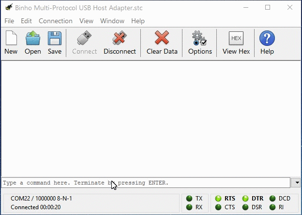

# Using the Buffer

The _Binho Nova Multi-Protocol USB Host Adapter_ features an internal data buffer which can be used with any of the supported protocols, both as an output buffer or an input buffer. The buffer has a maximum size of 256 bytes. While certainly far from the most interesting feature of the host adapter, it's presented in this guide before introducing the various protocol functionality so that you can have a basic understanding of it's existence and usage before diving into how to use the buffer with the different protocols.


All Buffer Commands must be prefaced by `BUF[n]` , where _n_ is the index of the internal buffer. The _Binho Nova Multi-Protocol USB Host Adapter_ features just one internal buffer, therefore the only valid value for _n_ at this time is _n_=0.


| Command   | Description                                | Link                                                                                 |
| --------- | ------------------------------------------ | ------------------------------------------------------------------------------------ |
| **CLEAR** | Clears the contents of the buffer          | [Details](https://support.binho.io/user-guide/ascii-interface/buffer-commands#clear) |
| **ADD**   | Adds a single byte of data into the buffer | [Details](https://support.binho.io/user-guide/ascii-interface/buffer-commands#add)   |
| **WRITE** | Writes n bytes of data into the buffer     | [Details](https://support.binho.io/user-guide/ascii-interface/buffer-commands#write) |
| **READ**  | Reads n bytes of data out of the buffer    | [Details](https://support.binho.io/user-guide/ascii-interface/buffer-commands#read)  |

See the sections related to each protocol to learn how to use the buffer in each specific use case.
